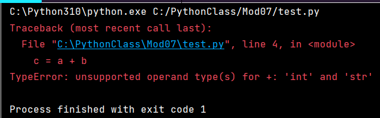
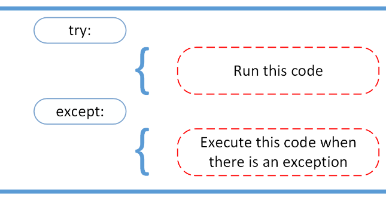

Exception Handling and Pickling
===============================

Introduction
------------
In this report, I will give an overview of Exception Handling and Pickling in Python.  I will go over a Python script I created to demonstrate these two concepts.  The program presents the user with two separate demos, one for each concept that the user can choose to view.

Exception Handling
------------------

In Python, errors that occur during code execution are called exceptions.  When exceptions occur, Python stops the program and displays an error message detailing the exception (Figure 1).  There are a of number exception types.  A few common ones are: 

+ •	TypeError - occurs when an operation is applied to objects of inappropriate types.
+ •	ValueError - occurs when an operation receives an argument that has the right type but an inappropriate value.
+ •	ZeroDivisionError – occurs when the second argument of a division operation is zero.

Figure 1: Example of a Python error message when a TypeError exception occurs.

Exception handling is used to catch and handle the errors so that the program does not end abruptly and allows the program to continue running.  This is accomplished with the try and except block.  Python executes code following the try statement and if any exceptions occur while running this code, instead of stopping the program, Python executes the code following the except statement as a response to the exceptions in the preceding try clause. (Figure 2)

Figure 2: Try...Except block for exception handling.  Image from RealPython.com.

In my demo script, I use a simple math operation to demonstrate exception handling with try and except blocks.  In the try clause, I use the operation to dividing the value of 100 by another value to generate exceptions. Then use the except clause to inform the user that an exception has occur and provide feedback on what that exception was before moving on and continue running the rest of the script.  The demo runs through creating a couple of different exceptions that can occur while performing the division operation on purpose and catches them. In my try and except block, I have a few except clause to catch a few of the more common exceptions like dividing by zero or trying to divide different data types and a general catch all one to handle all other type of exceptions.  (Figure 3)

text here

