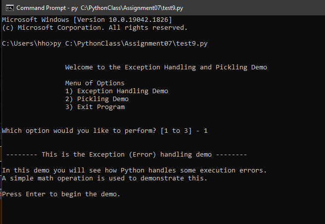

# Exception Handling and Pickling
*HHo, 08-24-2022*

 

## Introduction  

In this report, I will give an overview of Exception Handling and Pickling in Python.  I will go over a Python script I created to demonstrate these two concepts.  The program presents the user with two separate demos, one for each concept that the user can choose to view.  

 

## Exception Handling  

In Python, errors that occur during code execution are called exceptions.  When exceptions occur, Python stops the program and displays an error message detailing the exception (Figure 1).  There are a of number exception types.  A few common ones are: 

+ •	TypeError - occurs when an operation is applied to objects of inappropriate types.
+ •	ValueError - occurs when an operation receives an argument that has the right type but an inappropriate value.
+ •	ZeroDivisionError – occurs when the second argument of a division operation is zero.  
  

Figure 1: Example of a Python error message when a TypeError exception occurs.  

 

Exception handling is used to catch and handle the errors so that the program does not end abruptly and allows the program to continue running.  This is accomplished with the try and except block.  Python executes code following the try statement and if any exceptions occur while running this code, instead of stopping the program, Python executes the code following the except statement as a response to the exceptions in the preceding try clause. (Figure 2)  

 

Figure 2: Try...Except block for exception handling.  Image from RealPython.com.  

   
  
In my demo script, I use a simple math operation to demonstrate exception handling with try and except blocks.  In the try clause, I use the operation to dividing the value of 100 by another value to generate exceptions. Then use the except clause to inform the user that an exception has occur and provide feedback on what that exception was before moving on and continue running the rest of the script.  The demo runs through creating a couple of different exceptions that can occur while performing the division operation on purpose and catches them. In my try and except block, I have a few except clause to catch a few of the more common exceptions like dividing by zero or trying to divide different data types and a general catch all one to handle all other type of exceptions.  (Figure 3)  

 

Figure 3: Try...Except blocks to handle exceptions that may occur during division operation.  

   

## Pickling/Unpickling  

Pickling is the process of converting complex data or objects in Python into binary format for storage in a binary file.  The binary format can obscure the file’s content in a non-human readable format.  The pickle module must first be imported into the script for the pickle function to be available for use.  Pickling data to a file is very similar to writing standard data to a text file.  Open a binary (“.dat”) file and then call the pickle function and the dump() method, passing in the data to be pickled and the file as arguments, to convert the data into binary format and write to the file. (Figure 4)  

 

Figure 4: Sample code of pickling data to binary file.  

 
  
Unpickling is just the reversal of the pickling process.  It reads in a binary file and converts the binary formatted data and converts it back to its original human readable format.  This is accomplish with the load() method and it’s again similar to reading in standard data from a text file. (Figure 5)  

 

Figure 5: Sample code of unplicking data from a binary file.  

 
  
In my demo script, I demonstrate reading in and unpickling a table of data (list of dictionary rows) from a binary file.  Print out the table for the user to see.  After that, ask the user to input new data to be added to the list.  Then pickle that list back to the binary file.  

 

## Running the script  

I ran the script in both PyCharm and the command window and it ran properly on both.  Here is the program running in the command window. (Figure 6)  

 

Figure 6: Program running in command window.  

 

This is the script running in PyCharm. (Figure 7)  

 

Figure 7: Program running in PyCharm.  

 

This is a screenshot of the text file to verify that data is successfully written to a text file. (Figure 8)  

 

Figure 8: Verifying the data is in the binary file.  

 

## Summary  

I gave an overview of two concepts in Python.  One is exception handling with the use of the try and except block.  The other is pickling and the use of the dump() and load() methods to write and read to binary files.  I wrote a script that runs through a demonstration of each.  

